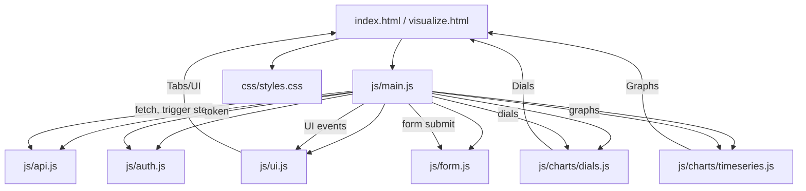

# IrrigMonitor Front-End

## Overview

IrrigMonitor is a modular, maintainable dashboard for irrigation monitoring, built with vanilla JavaScript and Chart.js. It supports both live data (from AWS backend) and simulation/demo mode.

---

## Project Structure

```
FrontEnd/
├── index.html              # Main dashboard entry point
├── visualize.html          # Standalone simulation/demo dashboard
├── css/
│   └── styles.css          # All CSS styles for layout, tabs, dials, graphs
├── js/
│   ├── main.js             # Main app logic: data fetch, event handlers, plotting, polling, backend triggers
│   ├── api.js              # API request logic (fetches data from backend)
│   ├── auth.js             # Handles authentication (token extraction, etc.)
│   ├── form.js             # Handles user data submission
│   ├── ui.js               # UI helpers: tab switching, UI initialization
│   └── charts/
│       ├── dials.js        # Renders soil moisture dials (Chart.js)
│       └── timeseries.js   # Renders time series graphs (Chart.js)
└── README.md
```

---

## System Logic and Data Flow

### 1. Authentication and Initialization
- On page load, `main.js` calls `getAuthToken()` (from `auth.js`) to extract the Cognito token from the URL.
- If the token is missing, the app halts and warns the user.

### 2. Data Fetching and Backend Trigger
- The app uses `fetchDSSData(authToken, callback)` (from `api.js`) to:
  - **Send a GET request** to the AWS API Gateway endpoint, including the auth token.
  - **If successful:**
    - The backend may trigger a Step Function (AWS Lambda workflow) to refresh or process data.
    - The API responds with the latest data.
    - The callback (in `main.js`) receives the data and updates the UI.
  - **If failed:**
    - Errors are logged to the console.

### 3. Polling/Refresh Loop
- The app can enter a **polling loop** (see `main.js`):
  - Periodically triggers the backend (via a special endpoint) to refresh data (by invoking a Step Function).
  - After each trigger, it waits and then calls `fetchDSSData` again to get the latest data.
  - This loop continues as long as the page is visible and polling is enabled.

### 4. Data Processing and Visualization
- When new data arrives:
  - `main.js` extracts relevant fields (soil moisture, rainfall, irrigation, ET, etc.).
  - Passes this data to chart rendering functions (`dials.js`, `timeseries.js`).
  - Updates UI elements (last value labels, dials, graphs).

### 5. User Interaction and UI Updates
- **Tab switching:**  Handled by `showTab(tabId)` in `ui.js`.
- **Responsive resizing:**  `initUI()` in `ui.js` attaches a resize listener to keep charts responsive.
- **Dropdowns and toggles:**  User can select soil depth or change units, which triggers chart updates.

### 6. Inputs, Outputs, and Loops
- **Inputs:**
  - User actions (tab, dropdown, toggle)
  - Auth token (from URL)
  - Data from backend API (via polling or manual fetch)
- **Outputs:**
  - API requests (fetch, trigger step function)
  - UI updates (charts, dials, labels)
- **Loops:**
  - Polling/refresh loop for live data updates
  - Event-driven UI update loop (on user actions)

---

## Component Analysis

### index.html / visualize.html
- **Role:** Entry points for the application (main dashboard and simulation).
- **Inputs:** User actions, real or synthetic data.
- **Outputs:** Rendered dashboard UI, calls to JS modules to update UI and charts.

### css/styles.css
- **Role:** Styles for all UI components: layout, tabs, dials, graphs, dropdowns, buttons.
- **Inputs:** HTML elements and their classes/IDs.
- **Outputs:** Visual appearance and responsive layout.

### js/main.js
- **Role:** Central controller for the dashboard. Orchestrates authentication, data fetching, event handling, plotting, polling, and backend triggers.
- **Key Functions:**
  - On load: Extracts auth token, initializes UI, fetches data, calls plotting routines.
  - Polling loop: Periodically triggers backend refresh (Step Function) and re-fetches data.
  - Event handlers: Unit toggle, dropdown, tab switching.
  - Data flow: Receives data from backend, processes for dials/graphs, passes to chart modules.
- **Inputs:** Auth token, backend data, user events.
- **Outputs:** Calls to chart rendering functions, UI updates, backend triggers.

### js/api.js
- **Role:** Handles all data fetching from the AWS backend.
- **Key Function:**
  - `fetchDSSData(authToken, callback)`: Makes a GET request to the backend API with the provided auth token. On success, calls the provided callback with the data.
- **Inputs:** Auth token, callback function.
- **Outputs:** Data object (passed to callback).

### js/auth.js
- **Role:** Handles authentication token extraction from the URL.
- **Key Function:**
  - `getAuthToken()`: Parses the URL hash to extract the `id_token` parameter.
- **Inputs:** Browser URL.
- **Outputs:** Auth token string.

### js/ui.js
- **Role:** Handles UI logic for tab switching and responsive resizing.
- **Key Functions:**
  - `showTab(tabId)`: Activates the selected tab and its content.
  - `initUI()`: Adds a window resize listener to resize all charts dynamically.
- **Inputs:** User tab clicks, window resize events.
- **Outputs:** DOM class changes, chart resizing.

### js/charts/dials.js
- **Role:** Renders soil moisture dials using Chart.js.
- **Key Function:**
  - `createDials(levels, mawdArr, fcArr, maxValue)`: For each soil depth, renders a dial showing the current moisture. Colors indicate management zones (deficient, optimal, excessive).
- **Inputs:** Soil moisture values, management thresholds (MAWD, FC), max value.
- **Outputs:** Rendered dials (canvas elements).

### js/charts/timeseries.js
- **Role:** Renders all time series graphs using Chart.js.
- **Key Functions:**
  - `createRainfallGraph(timestamps, data)`
  - `createIrrigationGraph(timestamps, data)`
  - `createEvapotranspirationGraph(timestamps, data)`
  - `updateSoilMoistureGraph(dssData)`: Each function prepares and renders a specific graph. `updateSoilMoistureGraph` updates the soil moisture graph for the selected depth.
- **Inputs:** Time series data arrays, timestamps, selected depth.
- **Outputs:** Rendered graphs (canvas elements).

### js/form.js
- **Role:** Handles user data submission logic.
- **Key Function:**
  - `attachFormListener(authToken)`: Submits user data to the backend via POST.
- **Inputs:** User form input, auth token.
- **Outputs:** Data submission to backend.

---

## Visual Diagram



---

## Inputs, Outputs, and Loops

| Routine/Loop         | Input(s)                | Output(s)                | Description                                                      |
|----------------------|-------------------------|--------------------------|------------------------------------------------------------------|
| Auth Initialization  | URL hash                | Auth token               | Extracts token for API access                                    |
| Data Fetch           | Auth token              | Data (JSON)              | Calls API, receives data, triggers UI update                     |
| Step Function Trigger| Auth token              | Backend refresh          | Triggers backend workflow to update data                         |
| Polling Loop         | Timer, visibility       | Repeated fetch/trigger   | Keeps data fresh by looping API calls                            |
| UI Event Loop        | User actions            | UI updates               | Updates charts, dials, labels on user input                      |
| Chart Rendering      | Data arrays             | Canvas graphs/dials      | Visualizes data using Chart.js                                   |

---

## Extending the Project

- Add new graphs or dials by extending `charts/`.
- Add new API endpoints in `api.js`.
- Add new UI features in `ui.js` and `main.js`.

---

## For Developers

- All business logic is in `main.js`.
- All rendering is in `charts/`.
- All data fetching is in `api.js`.
- All UI state is in `ui.js`.

---

## License

MIT


